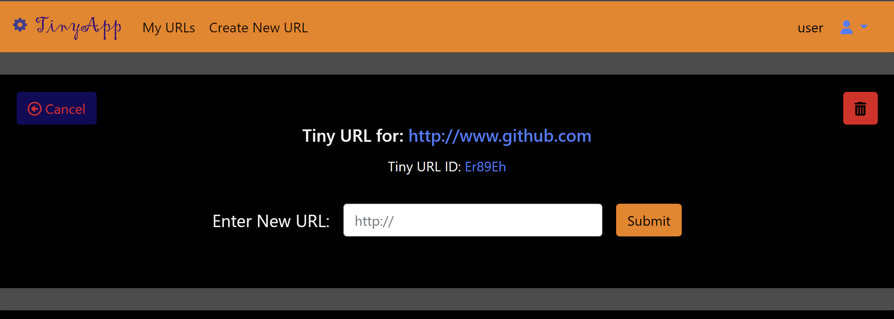

# TinyApp!
## About...
TinyApp! is a free URL shortening service and link management system derived from the <a href="www.lighthouselabs.ca">Lighthouse Labs</a> (LHL) full stack web development bootcamp project.

Existing LHL students can review the project here:  
https://flex-web.compass.lighthouselabs.ca/projects/tiny-app  

---
## Contents...
1. [Features](#features)
2. [Extra Features](#extra-features)
3. [Future Plans](#future-plans)
4. [Quick Start](#quick-start)
5. [Detailed Operation](#detailed-operation)
6. [Known Bugs](#known-bugs)
8. [Updates](#updates)
---
## Features...
- Free service
- Secure
- Easy to use
- Allows for multiple tiny links to the same long URL
 
[( back to top 🔺)](#about)

---
## Extra Features...
- Hide menu bar if not logged in
- Incorrect password or username sends error to user
- Trying to create duplicate accounts sends error to user
- User profile & extended registration page with client & server side validation
- Delete account which also deletes user's URLs
- Custom logo
- Restricted access page if users try to edit or delete other's tiny URLs
- Tiny URLs cannot be created with invalid URLs
- _Stretch_: put & delete methods
- _Stretch_: shows total clicks on a tiny URL (in edit page)
- _Stretch_: shows unique clicks on a tiny URL (in edit page)
- _Stretch_: create click through log for each tiny URL  

[( back to top 🔺)](#about)

---
## Future Plans...
- Analytics including hourly click thru chart 
- Log file & database
- Light mode & switch between light & dark mode
- Additional link analytics (more graphs)
- Favourites listing of URLs
- Tab title icon
- Confirm delete prior to deleting
- Demo page
- Keep logged in
- Multiple tiny URL selection for bulk delete
- Allow main URL page sorting - by date added, long URL alphabetical, # of clicks, etc
- Track hackers - if registered users try to manipulate other owner ID's, track & block them by email & IP.
- Implement SQL databases & go live with TinyApp! 

[( back to top 🔺)](#about)

---
## Quick Start...
1) Clone and download from GitHub. Setup dependencies with  
  `npm install`   
2) Start the TinyApp Server in your terminal with  
  `npm start`   
3) Start the web app in your browser with  
  `localhost:1052/`

[( back to top 🔺)](#about)

---
## Detailed Operation...
1) Clone and download from GitHub. Setup dependencies with  
  `npm install`   
2) Start the TinyApp Server in your terminal with  
  `npm start`   
3) Start the web app in your browser with  
  `localhost:1052/`   
 Register for an account to create and manage your Tiny URLs.  

4) Once registered/signed in, you'll be directed to your main account page listing any Tiny URLs you've created. From the main page, you can edit, delete or create tiny URLs.

5) Create new tiny URLS with the "Create Tiny URL" option.  Simply enter the long URL, and click "submit". You'll return to the tiny URLs list (above) and see your new link added to the list! Ensure you enter a valid URL or a tiny URL will not be created.

6) Update and modify tiny URL destinations through a dedicated update page.  

7) Review, update and delete your user profile 

[( back to top 🔺) ](#about)

----
## Known Bugs...
- None Noted

[( back to top 🔺)](#about)

----
## Updates...
- Get the most recent version of TinyApp! [on our GitHub account here.](https://github.com/jradigan17/tinyapp).
- Change Log v 0.0 - 2022-08-20:  
    * (implementation)

[( back to top 🔺)](#about)

---

